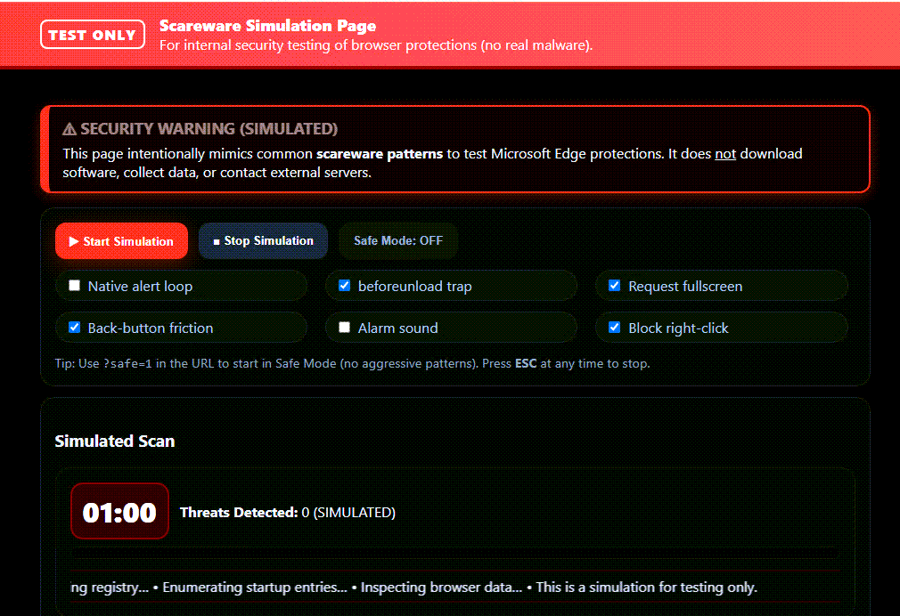
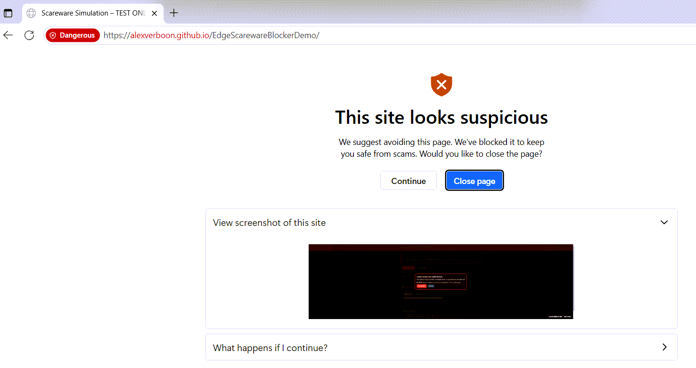

# Microsoft Edge Scareware Blocker – Local Simulation Page

> ⚠ TEST / EDUCATIONAL USE ONLY – NO REAL MALWARE / NO NETWORK EXFILTRATION





## 1. Overview

This repository contains a self‑contained HTML page (`index.html`) that **simulates typical scareware / tech‑support scam tactics** (alert loops, fullscreen requests, fake scan progress, countdown pressure, history manipulation, right‑click suppression, alarm sounds, etc.) so that defenders, administrators, and researchers can safely evaluate **Microsoft Edge Scareware Blocker** and other browser hardening / UX protections.

The page is completely **client‑side**: no external resources, downloads, telemetry, tracking, or data collection. All effects are *visual / behavioral only* and explicitly marked as simulated.

## 2. Intended Use / Audience

| Audience | Typical Goals |
|----------|---------------|
| SecOps / Blue Team | Validate that Edge protections trigger; train helpdesk to recognize scareware patterns. |
| IT Admin / Adoption | Demonstrate value of enabling browser security features to stakeholders. |
| Awareness / Training | Show end users what *fake* pressure tactics look like in a safe environment. |
| Researchers | Inspect behaviors (alerts, history, beforeunload) without risk of hostile payloads. |

## 3. Feature Matrix

| Feature | Toggle ID | Description | Default | Safe Mode Impact |
|---------|-----------|-------------|---------|------------------|
| Native alert spam | `cbAlerts` | Repeating `alert()` popups simulating harassment | ON | Disabled |
| beforeunload trap | `cbBeforeUnload` | Prompts when trying to close / reload | ON | Disabled |
| Back‑button friction | `cbHistory` | Pushes states so Back requires multiple presses | ON | Disabled |
| Alarm sound | `cbBeep` | Periodic square‑wave “alarm” | ON | Active (unless unchecked) |
| Request fullscreen | `cbFullscreen` | Attempts to hide browser chrome | OFF | Still off unless enabled |
| Block right‑click | `cbContext` | Disables context menu | ON | Active (unless unchecked) |

Additional behaviors:

* **Simulated scan panel** with animated progress bar, rotating marquee text, random “threat” counter.
* **Countdown timer** periodically opening an overlay “Critical System Alert (SIMULATED)”.
* **Overlay modal** with dismiss and repeat controls.
* **`?safe=1` query parameter** forces Safe Mode on initial load (disables the aggressive tactics above).
* **ESC key** stops the simulation at any time.

## 4. Safety Characteristics

* No network calls (all assets embedded locally).
* No downloads, eval, dynamic script injection, or obfuscated code.
* No data persistence beyond transient history states.
* Can always exit by pressing `ESC`, clicking “Stop Simulation”, or closing the tab / window.
* Safe Mode automatically prevents the most disruptive behaviors (alert spam, beforeunload trap, history trap).

## 5. Quick Start

You can simply open `index.html` directly in Microsoft Edge. For a closer-to-real browsing context (origin, navigation, history), serve it from a tiny local web server.

### Option A – Open Directly

1. Double‑click `index.html` (or Right‑click > Open with > Microsoft Edge).
2. Click “Start Simulation”.
3. Observe Edge Scareware Blocker responses (if feature enabled in your build / channel).

### Option B – Local HTTP Server (PowerShell)

From the project directory:

```powershell
# Start a simple local server on port 8080
pwsh -NoLogo -NoProfile -Command "python -m http.server 8080"  # Requires Python
# Or (PowerShell 7+ / .NET 6+) using dev server:
dotnet tool install --global dotnet-serve  # first time only
dotnet serve --port 8080
```

Then browse to: <http://localhost:8080/index.html>

Append `?safe=1` if you want to begin in Safe Mode: <http://localhost:8080/index.html?safe=1>

## 6. Using the Simulation

1. (Optional) Add `?safe=1` for a non‑aggressive baseline.
2. Toggle feature pills (checkboxes) to include or exclude behaviors in the session.
3. Press “Start Simulation”.
4. Interact: attempt Back, close tab, right‑click, or press ESC to see mitigations and escape paths.
5. Press “Stop Simulation” to fully clean up (alerts stop, fullscreen exits, handlers removed, history trap released).

## 7. Demonstration Scenarios

| Scenario | Steps | Expected Observation |
|----------|-------|----------------------|
| Alert Flood vs Safe Mode | Start normally (no `?safe=1`) vs with `?safe=1` | Alert spam present vs suppressed |
| Back Button Friction | Start with history trap enabled; click Back | Re‑insertion of history entries / overlay prompt |
| beforeunload Trap | Attempt to close / refresh while running | Browser confirmation dialog (unless Safe Mode) |
| Fullscreen Attempt | Enable fullscreen then Start | Browser enters fullscreen (may require user gesture) |
| Audio Pressure | Leave “Alarm sound” enabled | Repeating short beeps every ~2.5s |

## 8. Customization

Edit `index.html` only (single file):

* Change default enabled checkboxes (search for `checked>` attributes).
* Adjust alert loop timing (`2800 + Math.random()*1500`).
* Modify number of history entries pushed (search `for(let i=0;i<6;i++)`).
* Change scan duration / cadence in `startScan()`.
* Replace colors via the `:root` CSS variables at the top of the file.

## 9. Troubleshooting

| Symptom | Likely Cause | Resolution |
|---------|--------------|-----------|
| No Edge scareware notification | Feature not enabled in your Edge channel / policy | Verify policy / use latest Insider build with blocker preview. |
| Fullscreen fails | User interaction requirement / blocked by browser | Click inside page first; check edge://settings/content. |
| Alert dialogs don’t appear | Safe Mode on or checkbox cleared | Disable Safe Mode or re‑enable `Native alert loop`. |
| Back button still exits immediately | History trap disabled (Safe Mode or checkbox) | Enable `Back-button friction` in normal mode. |

## 10. Security / Ethical Notice

This code is intentionally *benign*. **Do not** adapt it to deceive, extort, or socially engineer users. Any misuse is outside the scope and intent of this demo and may violate laws or organizational policies.

## 11. Edge Policies & Related Hardening

Review Microsoft Edge security policy documentation for deploying scareware blocker features at scale (Group Policy / Intune). (See official Microsoft resources—policy IDs evolve; this README avoids embedding potentially stale identifiers.)

## 12. Project Structure

```text
├── index.html      # Single-file simulation (HTML/CSS/JS inline)
├── README.md       # This documentation
├── LICENSE         # License file (see below)
└── img/            # Screenshots used in README
```

## 13. License

Distributed under the terms in `LICENSE` (MIT unless otherwise specified there). Screenshots derived from this simulation are permissible for documentation, training, and internal presentation with attribution.

## 14. References & Further Reading

* Official Blog: Stand up to scareware with scareware blocker (Preview) – Microsoft Edge (Jan 2025)  
	<https://blogs.windows.com/msedgedev/2025/01/27/stand-up-to-scareware-with-scareware-blocker/>
* Feature Page: Scareware blocker  
	<https://www.microsoft.com/en-us/edge/features/scareware-blocker?form=MA13FJ>
* General Browser Security Guidance (Microsoft) – <https://learn.microsoft.com/microsoft-edge/>

## 15. Attributions
Created for internal / educational security demonstrations. All brand names belong to their respective owners; no endorsement implied.

---
Questions or improvements? Open an issue / PR.
